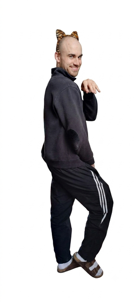
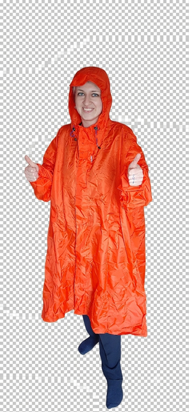
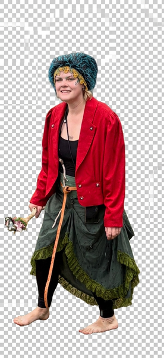

<!DOCTYPE html>
<html lang="de">
<head>
<meta charset="UTF-8">
<meta name="viewport" content="width=device-width, initial-scale=1.0, maximum-scale=1.0">
<title>Brauhaus Tour</title>

</head>
<body class="pixel-font">

  <!-- SCENE 1: WELCOME -->
  <section id="scene-welcome" class="scene flex items-center justify-center px-6">
    

      

        Bitte Namen eingeben
      

      

        <input
          id="name-input"
          type="text"
          maxlength="20"
          class="arcade-input pixel-font w-full px-4 py-3 text-sm sm:text-base"
          placeholder="..."
        >
        <button
          id="confirm-btn"
          class="arcade-btn pixel-font px-6 py-3 text-xs sm:text-sm w-full"
        >
          Bestätigen
        </button>
        

          Falscher Name! Versuch's nochmal!
        

      

    

  </section>

  <!-- SCENE 2: INTRO DIALOGUE -->
  <section id="scene-intro" class="scene scene-hidden flex flex-col items-center justify-end relative px-4 pb-6">

    <!-- Decorative room elements (simple shapes for "vintage living room" feel) -->
    

    

    

    <!-- Characters -->
    

      <!-- Bennet -->
      

        

          
          🐯
        

        
Bennet

      

      <!-- Maria -->
      

        

          
          🧥
        

        
Maria

      

      <!-- Nadine (slides in) -->
      

        

          
          🎉
        

        
Nadine

      

    

    <!-- Dialogue box -->
    

      

      

        
▼ klicken

        <button id="to-map-btn" class="arcade-btn px-4 py-2 text-[10px] sm:text-xs hidden">
          Zur Karte
        </button>
      

    

  </section>

  <!-- SCENE 3: MAP -->
  <section id="scene-map" class="scene scene-hidden flex flex-col items-center px-4 py-8 sm:py-12">

    

      <h1 class="text-amber-900 text-base sm:text-xl mb-2 leading-relaxed">
        Deine Brauhaus Tour
      </h1>
      

        Köln-Ehrenfeld &amp; Umgebung
      

    

    

      <!-- Map -->
      

        <svg viewBox="0 0 300 600" class="w-full h-auto" preserveAspectRatio="xMidYMid meet">
          <!-- Dotted path connecting stations -->
          <path class="path-line" d="M 150 60 L 220 200 L 90 340 L 200 500"></path>

          <!-- Station 1: Haus Scholzen -->
          <g class="station-dot selected" data-station="1">
            <circle cx="150" cy="60" r="30" fill="#D97706" stroke="#7C2D12" stroke-width="3"></circle>
            <text x="150" y="67" text-anchor="middle" font-size="22" font-family="sans-serif">🏠</text>
          </g>

          <!-- Station 2: Braustelle -->
          <g class="station-dot" data-station="2">
            <circle cx="220" cy="200" r="30" fill="#D97706" stroke="#7C2D12" stroke-width="3"></circle>
            <text x="220" y="207" text-anchor="middle" font-size="22" font-family="sans-serif">🍺</text>
          </g>

          <!-- Station 3: Päffgen -->
          <g class="station-dot" data-station="3">
            <circle cx="90" cy="340" r="30" fill="#D97706" stroke="#7C2D12" stroke-width="3"></circle>
            <text x="90" y="347" text-anchor="middle" font-size="22" font-family="sans-serif">🍻</text>
          </g>

          <!-- Station 4: Lommerzheim -->
          <g class="station-dot" data-station="4">
            <circle cx="200" cy="500" r="32" fill="#92400E" stroke="#451A03" stroke-width="3"></circle>
            <text x="200" y="508" text-anchor="middle" font-size="22" font-family="sans-serif">🏛️</text>
          </g>
        </svg>

        <!-- Station name labels -->
        

          
Haus Scholzen

          
Braustelle

          
Päffgen

          
Lommerzheim

        

      

      <!-- Info panel -->
      

        

          Deine nächste Station:
        

        <h2 id="panel-title" class="text-amber-900 text-sm sm:text-base mb-2 leading-relaxed">
          Haus Scholzen
        </h2>
        

          Ehrenfeld
        

        

          Ein urig-gemütliches Brauhaus mit langer Geschichte. Hier startet eure Tour. (Mini-Spiel folgt bald!)
        

      

    

  </section>

  

</body>
</html>
